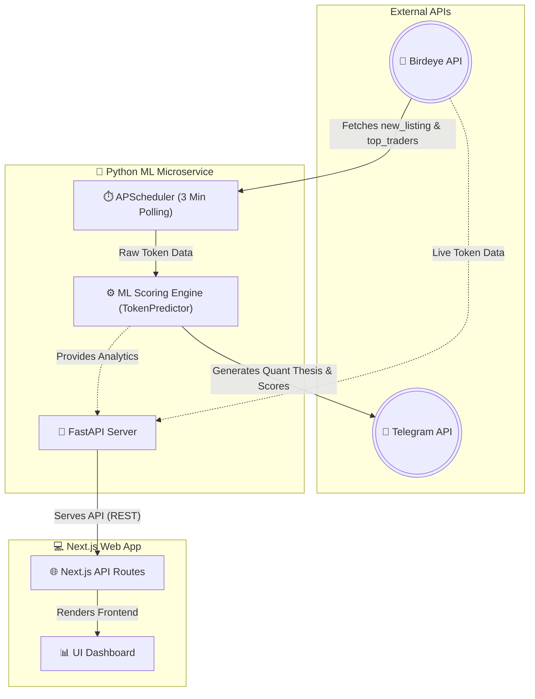

# 🦅 Birdeye Sentinel: Autonomous On-Chain Quant Agent

<div align="center">
  
  <p><em>Built for the Birdeye Data 4-Week BIP Competition (Sprint 2)</em></p>
</div>

## 📌 Overview
**Birdeye Sentinel** is an institutional-grade, AI-powered market scanning agent. Designed to filter through the noise of Solana's high-speed ecosystem, it autonomously monitors real-time on-chain data to discover high-conviction token setups before they break out.

It acts as an **Early Meme Discovery & Smart Money Alert Bot**, combining structural liquidity analysis with whale tracking to produce actionable intelligence.

## ✨ Key Features
- **⚡ Real-Time Scanning:** Constantly polls for new token listings on Solana.
- **🧠 AI Scoring Engine (Alpha & Risk):** Leverages a proprietary ML model to assign `0-100` scores based on structural edges, flagging honeypots, and highlighting genuine gems.
- **🐋 Smart Money Confluence:** Tracks the Top 3 traders (Whales) for a token, analyzing their aggregate volume and PnL to detect institutional accumulation vs. distribution.
- **💡 Quant Thesis Generation:** Automatically generates a human-readable thesis analyzing the Volume-to-Liquidity (V/L) ratio and historical breakout patterns.
- **🚀 One-Click Execution:** Delivers rich Telegram alerts complete with direct Raydium swap links and Birdeye charting.

## 🛠️ Birdeye Data Integration
This project extensively leverages the industry-leading **Birdeye API** to source real-time Solana metrics. We achieved a minimum of 50+ API calls autonomously via a background scheduler that polls every 3 minutes.

### Endpoints Utilized:
1. `GET /defi/v2/tokens/new_listing?limit=10`
   - **Use Case:** Feeding the baseline new tokens into the intelligence pipeline.
2. `GET /defi/token_overview?address={address}`
   - **Use Case:** Enriching token data (Price, Liquidity, 24h Vol, Price Change) for the ML Predictor.
3. `GET /defi/v2/tokens/top_traders?address={address}`
   - **Use Case:** Extracting aggregate PnL and trade volume of the top 3 whale wallets to calculate Smart Money accumulation.

## 🏗️ Architecture
The project employs a robust microservice architecture with two primary data flows: an **Autonomous Quant Agent** loop and an interactive **Web Dashboard** loop.



- **ML & Bot Microservice:** A scalable Python backend that autonomously pulls from Birdeye, scores tokens using Machine Learning, and pushes actionable alerts to Telegram. It also serves a FastAPI layer for the web interface.
- **Frontend / API Gateway:** A Next.js 14 application providing an interactive dashboard for users to visually review the AI's real-time findings.
- **Containerization:** Fully containerized using `Docker` & `docker-compose` to ensure environment consistency and seamless production deployment (e.g. via Dokploy).

## 🚀 Getting Started

### Prerequisites
- Docker and Docker Compose
- A [Birdeye API Key](https://bds.birdeye.so/)
- A Telegram Bot Token (from `@BotFather`)

### Installation
1. Clone the repository:
   ```bash
   git clone https://github.com/yourusername/birdeye-sentinel.git
   cd birdeye-sentinel
   ```
2. Set up your environment variables:
   ```bash
   cp .env.example .env
   # Add your BIRDEYE_API_KEY and Telegram credentials into the .env file
   ```
3. Boot up the autonomous agent:
   ```bash
   docker compose up --build -d
   ```

## 📸 Live Demo & Screenshots

<div align="center">
  
  <p><em>Real-time autonomous quant alerts directly to your mobile device.</em></p>
</div>

---
*If you find this project valuable, drop a ⭐️ and follow my journey on X: [@Sycon_xxx](https://x.com/Sycon_xxx)! #BirdeyeAPI*
