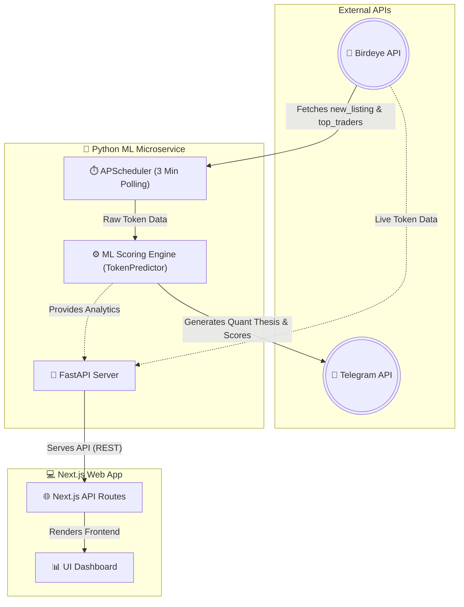
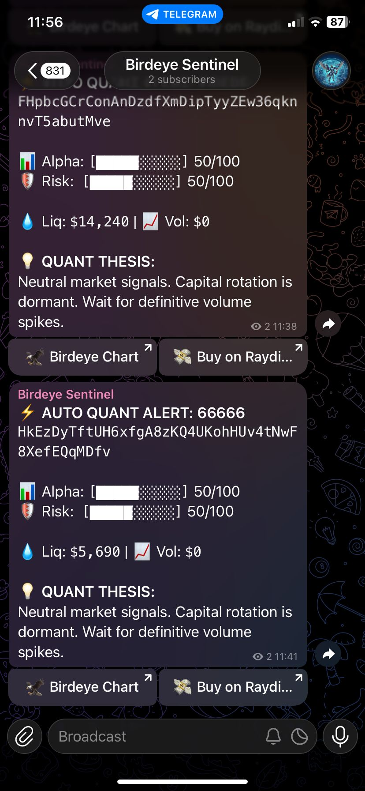

# 🦅 Birdeye Sentinel: Autonomous On-Chain Quant Agent

<div align="center">
  
  <p><em>Built for the Birdeye Data 4-Week BIP Competition (Sprint 2)</em></p>
</div>

## 📌 Overview
**Birdeye Sentinel** is an institutional-grade, AI-powered market scanning agent. Designed to filter through the noise of Solana's high-speed ecosystem, it autonomously monitors real-time on-chain data to discover high-conviction token setups before they break out.

It acts as an **Early Meme Discovery & Smart Money Alert Bot**, combining structural liquidity analysis with whale tracking to produce actionable intelligence.

## ✨ Key Features
- **⚡ Real-Time Scanning:** Constantly polls for high-volume and trending tokens on Solana.
- **🐋 Live Whale Watch:** An interactive dashboard section tracking massive on-chain swaps with real-time token logos and search functionality.
- **🧠 Institutional Analysis (Modal):** Deep-dive analysis for any whale trade, providing "Smart Money Conviction" scores and automated institutional theses.
- **🚨 Sybil Cluster Detection:** Advanced logic to identify wash-trading bot farms by detecting identical trading volumes and PnL patterns among top traders.
- **🧠 AI Scoring Engine (Alpha & Risk):** Leverages a proprietary ML model to assign `0-100` scores based on structural edges and liquidity-to-volume ratios.
- **📱 Autonomous Whale Radar (Telegram):** A sophisticated bot that broadcasts high-conviction whale movements, including institutional accumulation alerts and Sybil warnings.

## 🚀 API Optimization & Redis Caching
To ensure institutional-grade performance while staying within **Birdeye API credit limits (e.g. 30k/month)**, we implemented a sophisticated multi-layer caching system:

- **⚡ Redis Shared Cache:** All high-frequency Birdeye requests (Security, Top Traders, Trending) are cached in a centralized **Redis** layer.
- **📉 80% Credit Reduction:** By caching token metadata for 5 minutes and trading activity for 45-60 seconds, we've reduced redundant API calls by approximately **80%**.
- **🧠 Intelligent Proxying:** The Next.js frontend fetches almost all data through the Python ML service, ensuring both services share the same Redis cache and never pull duplicate data from Birdeye.
- **🕒 Optimized Polling:** Background schedulers and frontend tickers are dynamically tuned to balance "Real-Time" feel with credit conservation.

## 🛠️ Birdeye Data Integration
This project extensively leverages the industry-leading **Birdeye API** to source real-time Solana metrics. Through our Redis optimization, we serve a data-dense experience that would normally cost 5x more credits.

### Endpoints Utilized:
1. `GET /defi/tokenlist?sort_by=v24hUSD`
   - **Use Case:** Discovering the most active tokens on Solana to identify whale hotspots.
2. `GET /defi/v2/tokens/new_listing?limit=10`
   - **Use Case:** Feeding baseline new tokens into the ML intelligence pipeline.
3. `GET /defi/txs/token?address={address}`
   - **Use Case:** Powering the "Recent Orders" feed in the detailed whale analysis modal.
4. `GET /defi/v2/tokens/top_traders?address={address}`
   - **Use Case:** Analyzing Sybil clusters and Whale Quality Index (PnL/Vol ratio).
5. `GET /defi/token_overview?address={address}`
   - **Use Case:** Enriching token data (Liquidity, Price, Security) for scoring.

## 🏗️ Architecture
The project employs a robust microservice architecture with two primary data flows: an **Autonomous Quant Agent** loop and an interactive **Web Dashboard** loop.



- **ML & Bot Microservice:** A scalable Python backend that autonomously pulls from Birdeye, scores tokens using Machine Learning, and pushes actionable alerts to Telegram. It also serves a FastAPI layer for the web interface.
- **Frontend / API Gateway:** A Next.js 14 application providing an interactive dashboard for users to visually review the AI's real-time findings.
- **Containerization:** Fully containerized using `Docker` & `docker-compose` to ensure environment consistency and seamless production deployment (e.g. via Dokploy).

## 🚀 Getting Started

### Prerequisites
- Docker and Docker Compose
- A [Birdeye API Key](https://bds.birdeye.so/)
- A Telegram Bot Token (from `@BotFather`)

### Installation
1. Clone the repository:
   ```bash
   git clone https://github.com/yourusername/birdeye-sentinel.git
   cd birdeye-sentinel
   ```
2. Set up your environment variables:
   ```bash
   cp .env.example .env
   # Add your BIRDEYE_API_KEY and Telegram credentials into the .env file
   ```
3. Boot up the autonomous agent:
   ```bash
   docker compose up --build -d
   ```

## 📸 Live Demo & Screenshots

<div align="center">
  
  <p><em>Real-time autonomous quant alerts directly to your mobile device.</em></p>
</div>

---
*If you find this project valuable, drop a ⭐️ and follow my journey on X: [@Sycon_xxx](https://x.com/Sycon_xxx)! #BirdeyeAPI*
